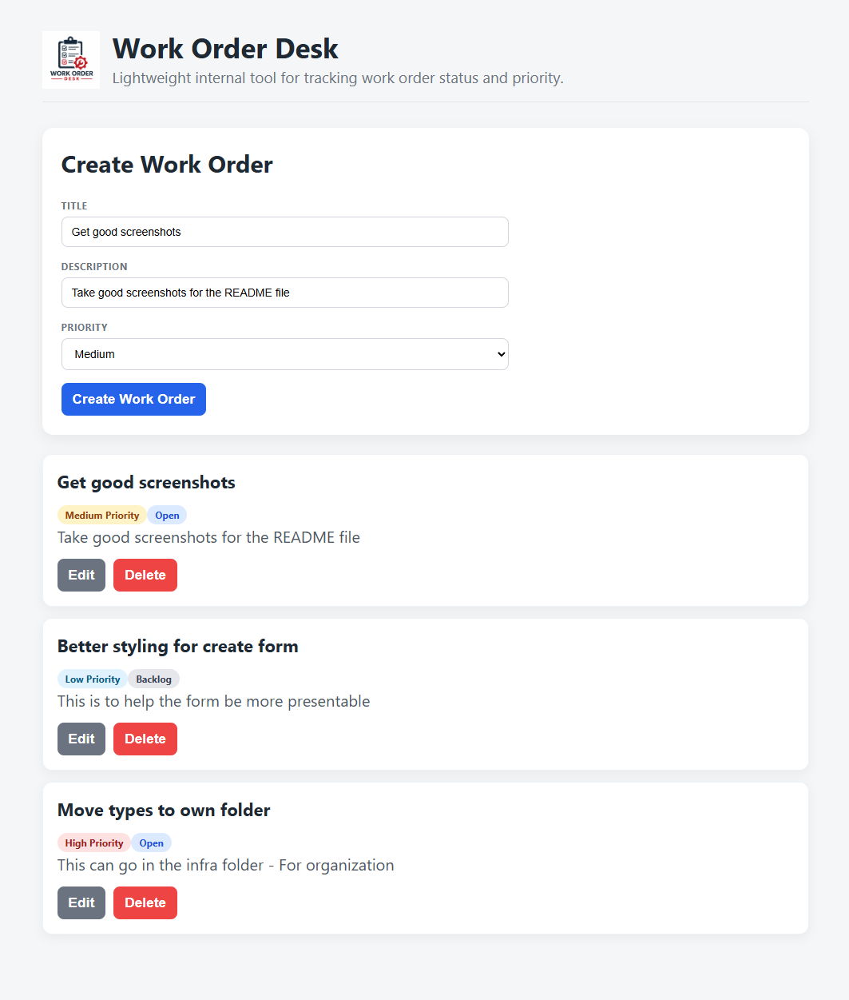
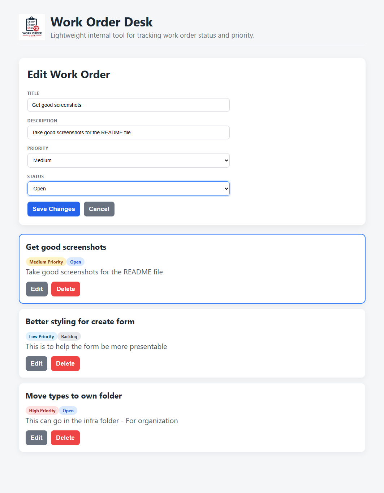
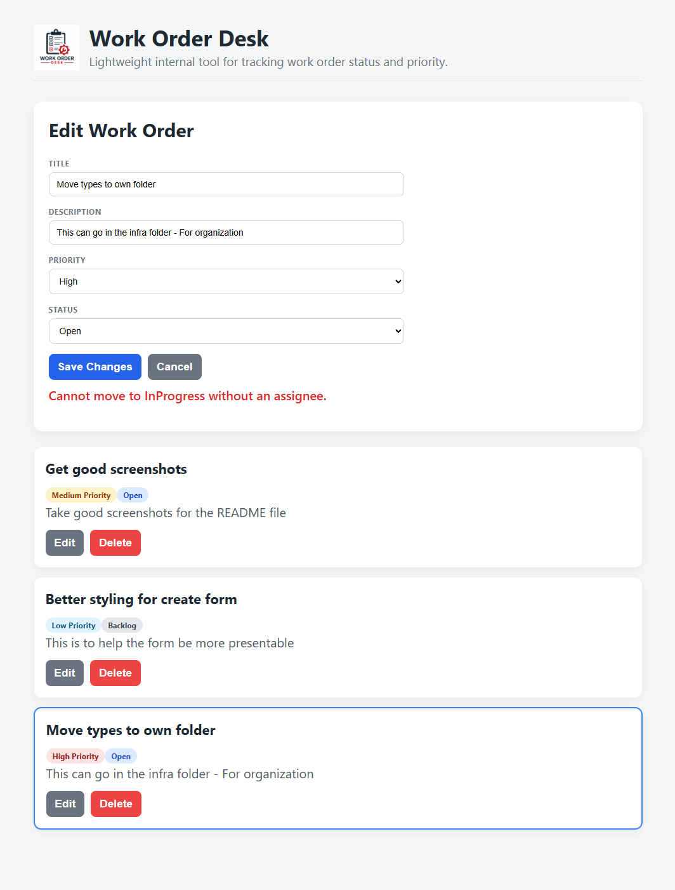

# 🎨 Work Order Desk Web

Frontend application for the **Work Order Desk** system.

A responsive, user-friendly interface for creating, managing, and tracking work orders across different states and priorities.

---

## 🌐 Live Demo

> Coming soon

Frontend: (add link when deployed)
Backend API: (add link when deployed)

---

## 🚀 Overview

Work Order Desk is a full-stack application designed to model a real-world internal tool used to manage and track work orders.

The frontend focuses on:

- Creating, editing, and deleting work orders
- Managing status transitions (Backlog → Open → In Progress → Complete → Archived)
- Displaying priority and state with clear visual indicators
- Handling server state using React Query
- Providing responsive feedback for loading, success, and error states

---

## ✨ Key Features

- Full CRUD operations for work orders
- Reusable form component supporting both create and edit modes
- Optimized server state management with React Query
- Status and priority badge system for quick visual scanning
- Error handling and validation surfaced in the UI
- Feature-based frontend architecture for scalability

---

## 🖼️ Screenshots

### 📊 Dashboard Overview



### ✏️ Edit Work Order



### ⚠️ Error Handling



---

## 🧱 Architecture

The project follows a **feature-based architecture**, organizing code by responsibility rather than file type.

### Structure

- **ui/**
  - Pages and presentational components
  - Responsible for rendering UI

- **features/**
  - Business logic and feature-specific hooks
  - Handles API interactions and state management

- **domain/**
  - Type definitions and domain models
  - Shared data structures across the app

- **infra/**
  - HTTP client and external integrations
  - Encapsulates API configuration and requests

---

## 🧠 Architecture Philosophy

This project is structured to reflect production-level frontend patterns:

- **Separation of concerns** between UI, data fetching, and domain modeling
- **Feature-based organization** for scalability as the application grows
- **Reusable components** to reduce duplication and improve maintainability
- **Server-state management** handled explicitly via React Query

The goal is to mirror how modern frontend systems are designed in real-world applications.

---

## ⚙️ Tech Stack

- **React** – UI library for building interfaces
- **TypeScript** – Strong typing and developer experience
- **Vite** – Fast development and build tooling
- **@tanstack/react-query** – Server state management and caching

---

## 🚀 Running Locally

```bash
npm install
npm run dev
```

---

## 🧪 Development Principles

This project emphasizes:

- Clear separation of concerns
- Scalable and maintainable architecture
- Strong typing with TypeScript
- Efficient data fetching and caching
- Readable and testable code

---

## 📝 Commit Message Convention

This project follows a simplified **Conventional Commits** format:

```text
type(scope): short summary
```

### Examples

```text
chore: initialize project setup
feat(workorders): add WorkOrder domain model
feat(api): add create work order endpoint
fix(infrastructure): correct HTTP client configuration
refactor(features): extract validation logic
docs: update README with architecture overview
test(domain): add WorkOrder validation tests
```

---

## 📚 CHANGELOG Policy

This project maintains a manual `CHANGELOG.md`.

Each merge should include an entry under the **Unreleased** section.

### Format

```markdown
## [Unreleased]

### Added

- WorkOrder domain model
- CreateWorkOrder endpoint

### Changed

- Refactored validation logic

### Fixed

- Corrected API error handling
```

### Release Example

```markdown
## [0.1.0] - 2026-02-23

### Added

- Initial frontend structure
- React Query integration
- Work order creation flow
```

---

## 🔢 Versioning Strategy

This project follows **Semantic Versioning (SemVer)**:

```text
MAJOR.MINOR.PATCH
```

- **MAJOR** – Breaking changes
- **MINOR** – New features
- **PATCH** – Bug fixes

---

## 🔗 Related Projects

- Backend API: https://github.com/Pherpher089/work-order-desk-api
- GitHub Profile: https://github.com/pherpher089

---

## 💡 About This Project

This project is part of a broader full-stack system and is intended to demonstrate:

- Full-stack application architecture
- Frontend scalability patterns
- Clean separation of responsibilities
- Real-world development practices
- Modern state management using React Query
