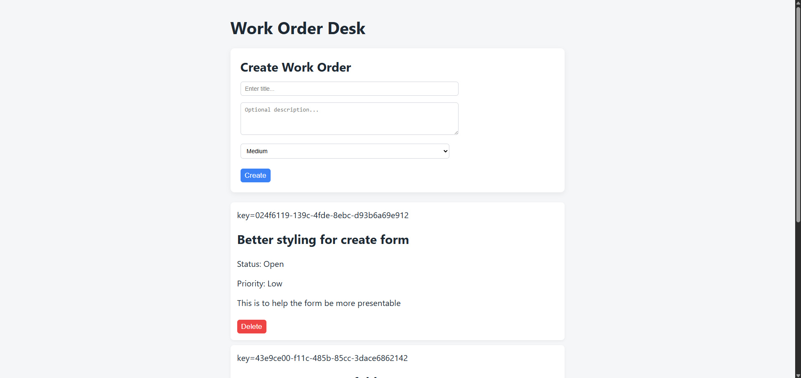
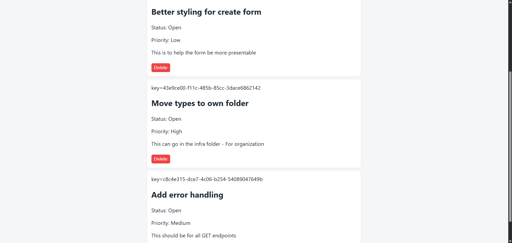

# 🎨 Work Order Desk Web

Frontend application for the **Work Order Desk** system.

This project provides a responsive, user-friendly interface for creating, managing, and tracking work orders across different states and users.

---

## 🚀 Overview

Work Order Desk is designed to demonstrate a **real-world, full-stack application architecture** with a focus on maintainability, scalability, and clear separation of concerns.

The frontend is responsible for:

* Creating and managing work orders
* Displaying work order state transitions
* Communicating with backend APIs
* Providing a clean and intuitive user experience

---

## 🖼️ Screenshots

### Create Work Order



### Work Order List



---

## 🧱 Architecture

The project follows a **feature-based architecture**, organizing code by responsibility rather than file type.

### Structure

* **ui/**

  * Pages and presentational components
  * Responsible for rendering UI

* **features/**

  * Business logic and feature-specific hooks
  * Handles API interactions and state management

* **domain/**

  * Type definitions and domain models
  * Shared data structures across the app

* **infra/**

  * HTTP client and external integrations
  * Encapsulates API configuration and requests

---

## ⚙️ Tech Stack

* **React** – UI library for building interfaces
* **TypeScript** – Strong typing and developer experience
* **Vite** – Fast development and build tooling
* **@tanstack/react-query** – Server state management and caching

---

## 🚀 Running Locally

```bash
npm install
npm run dev
```

---

## 🧪 Development Principles

This project emphasizes:

* Clear separation of concerns
* Scalable and maintainable architecture
* Strong typing with TypeScript
* Efficient data fetching and caching
* Readable and testable code

---

## 📝 Commit Message Convention

This project follows a simplified **Conventional Commits** format:

```text
type(scope): short summary
```

### Examples

```text
chore: initialize project setup
feat(workorders): add WorkOrder domain model
feat(api): add create work order endpoint
fix(infrastructure): correct HTTP client configuration
refactor(features): extract validation logic
docs: update README with architecture overview
test(domain): add WorkOrder validation tests
```

---

## 📚 CHANGELOG Policy

This project maintains a manual `CHANGELOG.md`.

Each merge should include an entry under the **Unreleased** section.

### Format

```markdown
## [Unreleased]

### Added
- WorkOrder domain model
- CreateWorkOrder endpoint

### Changed
- Refactored validation logic

### Fixed
- Corrected API error handling
```

### Release Example

```markdown
## [0.1.0] - 2026-02-23

### Added
- Initial frontend structure
- React Query integration
- Work order creation flow
```

---

## 🔢 Versioning Strategy

This project follows **Semantic Versioning (SemVer)**:

```text
MAJOR.MINOR.PATCH
```

* **MAJOR** – Breaking changes
* **MINOR** – New features
* **PATCH** – Bug fixes

---

## 🔗 Related Projects

* Backend API: https://github.com/Pherpher089/work-order-desk-api
* GitHub Profile: https://github.com/pherpher089

---

## 💡 About This Project

This project is part of a broader full-stack system and is intended to demonstrate:

* Full-stack application architecture
* Frontend scalability patterns
* Clean separation of responsibilities
* Real-world development practices
